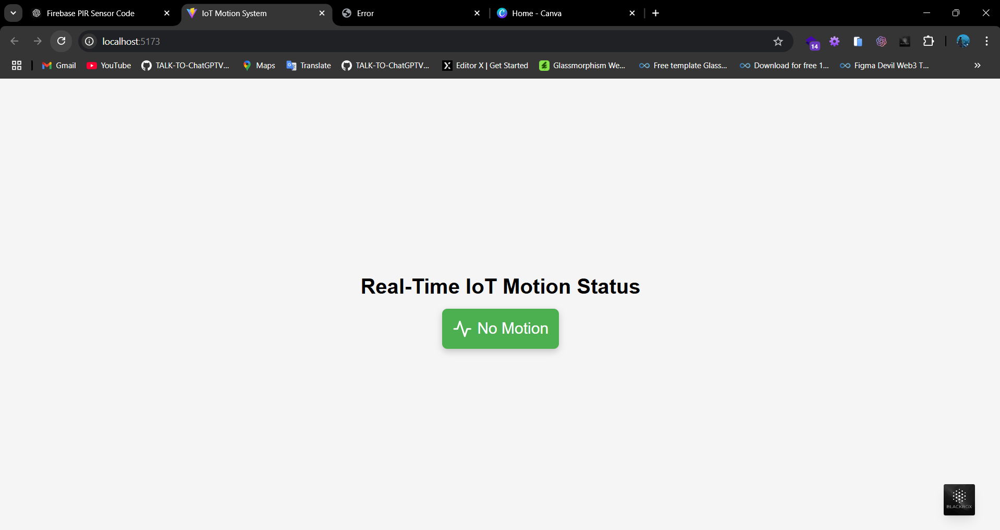
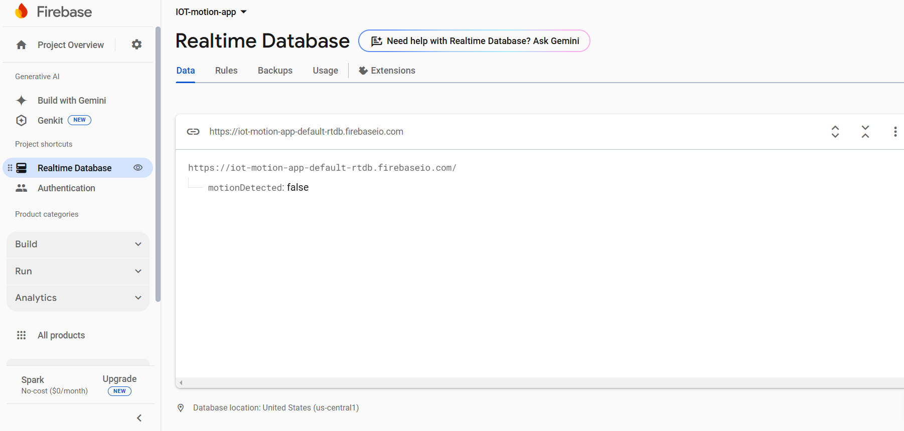

# Wi-Fi Motion Detection System

This project implements a **Wi-Fi Motion Detection System** using **Firebase**, **ESP32**, and a **Vite + React + TypeScript** frontend with a **Node.js** backend. The system detects motion through a PIR sensor, updates the motion status to **Firebase Realtime Database**, and displays the status on the frontend. The backend communicates with Firebase to manage the motion data.

---

## 📜 Project Summary

The **Wi-Fi Motion Detection System** is designed to detect motion in a given area using an **ESP32 microcontroller** and a **PIR motion sensor**. The system sends real-time motion status to a **Firebase Realtime Database** and allows users to monitor the status through a **web application** built with **Vite, React, and TypeScript** on the frontend, while a **Node.js** backend handles Firebase interactions.

---

## 🔧 Features

- **Motion Detection**: Uses a **PIR sensor** to detect motion in the environment.
- **Real-time Updates**: Motion status is sent to **Firebase Realtime Database** in real time.
- **Frontend**: Built with **Vite, React, and TypeScript** to display motion status.
- **Backend**: A **Node.js** server manages Firebase interactions and data processing.
- **Wi-Fi Connectivity**: **ESP32** connects to a Wi-Fi network for cloud communication.

---

## 🛠️ Tech Stack

- **Frontend**: 
  - **Vite** – Fast build tool and development server.
  - **React** – Frontend framework for building the user interface.
  - **TypeScript** – Static typing for better code quality.
  - **Firebase** – Cloud-based real-time database for storing motion status.

- **Backend**:
  - **Node.js** – JavaScript runtime environment for the backend server.
  - **Express.js** – Web framework for building the REST API.
  - **Firebase Admin SDK** – Firebase Admin for backend interaction with Firebase Realtime Database.

- **Hardware**:
  - **ESP32** – Microcontroller with built-in Wi-Fi.
  - **PIR Sensor** – Passive Infrared sensor for motion detection.

---

## ⚡ How It Works

1. **Motion Detection**:
   - The **PIR sensor** detects motion and triggers an alert.

2. **Data Transfer**:
   - The **ESP32** sends motion status (`true` for detected motion, `false` otherwise) to the **Firebase Realtime Database** via Wi-Fi.

3. **Frontend**:
   - The **React app** listens to the database and displays the current motion status to the user in real time.

   ### Screenshot: Frontend Motion Detected Status
   

   ### Screenshot: Frontend No Motion Status
   

4. **Backend**:
   - The **Node.js server** handles the logic for writing motion data to Firebase via the Admin SDK.

---

## 🔄 Firebase Realtime Database

The motion status is stored in the **Firebase Realtime Database**, which updates the frontend in real time.

### Screenshot: Firebase Realtime Database


---

## 🚀 Getting Started

### **Frontend Setup (Vite + React + TypeScript)**

1. Clone the repository:
   ```bash
   git clone https://github.com/thenujad/wi-fi-motion-detection.git
   cd wi-fi-motion-detection/motion-detection-frontend
   ```

2. Install dependencies:
   ```bash
   npm install
   ```

3. Create a **Firebase configuration file** in `src/firebase/config.ts` and set up your Firebase credentials (Refer to the Firebase Setup Guide).

4. Start the frontend development server:
   ```bash
   npm run dev
   ```

### **Backend Setup (Node.js)**

1. Clone the repository:
   ```bash
   git clone https://github.com/thenujad/wi-fi-motion-detection.git
   cd wi-fi-motion-detection/backend
   ```

2. Install dependencies:
   ```bash
   npm install
   ```

3. Set up Firebase Admin SDK by placing your **service account key** in the backend directory.

4. Start the backend server:
   ```bash
   npm start
   ```

---

## 🌐 Firebase Setup

To integrate Firebase into the project:

1. Go to the **Firebase Console** and create a new project.
2. Set up **Firebase Realtime Database**.
3. Create a **Firebase Web App** and copy the Firebase config values (API Key, Project ID, etc.) for both frontend and backend configurations.
4. For the backend, generate a **service account key** in the Firebase Console and place it in the backend directory.

---

## 🖥️ Frontend Features

- **Real-time Motion Status**: The frontend listens to the Firebase Realtime Database for updates and displays the current motion status (`Motion Detected` or `No Motion`).
- **Responsive UI**: The app adjusts to various screen sizes for a smooth user experience.

---

## 🚀 Future Enhancements

- **Notification System**: Add email/SMS notifications when motion is detected.
- **User Authentication**: Implement Firebase Authentication to manage users securely.
- **Historical Data**: Store and view historical motion detection data in the frontend.

---

## 💡 Troubleshooting

- **No Motion Detected**: Ensure the **PIR sensor** is connected properly to the ESP32 and the sensor is calibrated.
- **Wi-Fi Connectivity Issues**: Check the ESP32 Wi-Fi credentials and ensure the device is connected to the correct network.
- **Firebase Configuration**: Double-check the Firebase API key and database URL.

---

## 📄 License

This project is licensed under the MIT License – see the [LICENSE](LICENSE) file for details.

---

### 🤝 Contributing

1. Fork the repository.
2. Create a new branch (`git checkout -b feature/your-feature`).
3. Commit your changes (`git commit -am 'Add new feature'`).
4. Push to the branch (`git push origin feature/your-feature`).
5. Create a new Pull Request.
